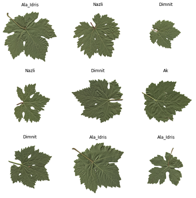

# classification-grape-leaves
Using a data set including five types of grape leaves (100 unique photos of each type) and deep learning, we are trying to build a model to perform this classification well.

With simple convolutional neural network we would not achive high accuracy, so we done below steps to improve our accuracy(you can check the complete details in report.pdf).

* Used transfer learning(use pretrained MobileNetV2)
* Used augmentation to increase data size
* Used fooly connected net as classification part
* Used SVM as  classification part(for better result)

# Data set
You can get the dataset with the following link: https://www.muratkoklu.com/datasets/Grapevine_Leaves_Image_Dataset.zip

# Libraries

# Contact
Created by samanarzaghi@ut.ac.ir / arzaghi.sam@gmail.com - feel free to contact me!
